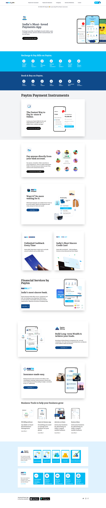

# Hey I am Subhadip Chatterjee 👋

## Project Name: Paytm Clone by Tailwind CSS

---

### Project Descripttion

> **This is a large project where I have made paytm clone by using Tailwind CSS and this project is mobile responsive also, Hope you like my project**

---

## 🛠 Technologies used

> HTML

> Tailwind CSS

---

## What I have learnt in this project

> As this is my first project on Tailwind CSS, I learned how to use the classes

> Learned about the responsiveness

> Got good understanding on responsiveness, breakpoints and many other classes

---

## Time taken to Finish this project

> I have taken 1 full day to understand and complete this project, this was my first project on Tailwind.

## Feedback

> For any kind of feedback please contact me on my email: subha.chat143@gmail.com and social links are also provided in my profile, feel free to connect with me.

> please check the below project screenshot and video

## Project Demo

> [paytm-clone](recording.webm)

## Project Screenshot

> 
